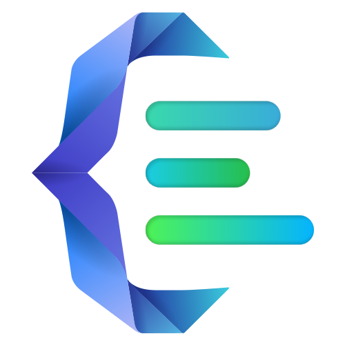

<p align="center">
  
</p>

# [OpenDoc UI](https://omidgfx.github.io/opendoc-ui/)

A static-first documentation browser, API runner, and optional AI assistant for **Swagger 2.x** and
**OpenAPI 3.x** specifications (JSON or YAML). Point it at a spec — via configuration or straight
from your disk — and it renders the whole API: endpoints grouped by tag, schemas, examples,
authentication schemes, a built-in request runner, code/type generators, deep-linkable URLs,
full theming, and grounded AI answers. The documentation UI never requires a backend; AI can use
CORS-enabled providers directly or an optional gateway.

[](https://omidgfx.github.io/opendoc-ui/)
  [](https://omidgfx.github.io/opendoc-ui/demo/)

**[Open the live demo →](https://omidgfx.github.io/opendoc-ui/demo/)** Browse the bundled Complete Capability Showcase specification or open your own JSON/YAML files directly in the hybrid demo.

---

## Features

- **Documentation browser** — tag folders with nested groups, endpoint list, parameter
  tables, request bodies, response examples and full schema inspection.
- **Unified schema viewer** — one SchemaViewer for request bodies, responses, and the schema
  modal, with generated examples, field combinator menus, and body-level oneOf/anyOf/allOf/not rails.
- **Built-in API runner** — execute requests straight from the browser with bearer token,
  API-key, basic auth and cookie support; use recursive nested-object/array forms, edit JSON/YAML/XML
  raw bodies with format-aware validation, and view bounded response details. CORS permitting, no
  proxy is needed. OAS 3.2 **QUERY** (RFC 10008) is first-class beside GET/POST and additional operations.
- **Code & type generators** — fetch / axios / Angular snippets plus TypeScript models,
  generated from your schemas, downloadable as a zip.
- **Global search** — `Ctrl/⌘ + K` searches paths, summaries, tags and schema definitions,
  with method/tag/security filters that sync with the sidebar.
- **Themes** — 15+ hand-picked palettes, per-spec memory, light / dark / **system** modes.
- **Deep links** — every endpoint, open tab, response code and schema modal is encoded in the
  URL, so any view is shareable and re-openable.
- **View tabs** — the specification overview, global search, schema explorer, about page, and
  AI assistant open as tabs in the same bar as endpoints: preview/pin, close, reorder,
  middle-click and context-menu all behave identically.
- **OpenDoc UI assistant** — ask grounded questions using retrieved redacted endpoint/schema context,
  see source citations, use Swagger/REST skill packs, save conversations per spec, and prepare
  requests in the existing API Runner.
- **Local mode** — no configuration at all: open `.json` / `.yaml` / `.yml` files from your
  device, with a persistent history of everything you opened.
- **Local endpoint notes** — keep private Markdown notes and todos per endpoint, choose from fourteen
  translucent theme-safe tones, optionally hide an endpoint after confirming its last todo, and
  export/import every note as JSON with orphaned-note detection.
- **Hidden endpoints** — move endpoints into a muted folder without changing the OpenAPI source,
  then unhide them individually or restore every hidden endpoint from navigation settings.
- **Remote URL loading** — optional build-time capability with CORS guidance, downloaders/direct fallbacks,
  persistent URL history, cache revalidation, and hardened downloader examples in six backend languages.
- **Spec caching** — remote specs use a bounded-TTL cache with ETag / Last-Modified
  revalidation; persistent state and raw documents use IndexedDB instead of consuming the localStorage quota.
- **Reference-safe rendering** — unresolved, circular, and multi-file `$ref` graphs are diagnosed without taking down unrelated views; recursive property matrices and Runner forms stop at cycle boundaries, and missing local files can be added after the root is opened.
- **Clean routes** — endpoint, schema, compatibility, and assistant links use normal paths while retaining legacy hash-link compatibility.
- **Crash recovery** — view-level boundaries isolate malformed endpoint/schema content, while the global recovery screen remains the final fallback.

---

## Version 0.3.5

Backend-owned **Managed AI mode** on top of 0.3.4:

- organizations configure the assistant once on their backend; OpenDoc UI discovers it at
  `GET /api/ai/policy` and self-configures — **no user profiles, no AI settings UI, and no
  authorization data in the browser**;
- ambient authentication delegates user identity to the existing perimeter (SSO session / reverse
  proxy), with optional per-user rate limiting from an edge identity header;
- the assistant, settings, and sidebar lock to the managed identity ("provided by your
  organization"); model identity is masked by default and error copy is sanitized;
- runtime `ai.managed` config block or `VITE_AI_MANAGED*` env activates it; `docker compose
--profile managed-ai` ships a one-command reference deployment;
- **specification-first branding**: when the document declares `info.x-logo`, its icon is the
  principal mark in the top bar and on the home search page, with the OpenDoc mark as the fallback;
  spec-declared logo backgrounds are ignored so OpenDoc themes stay in control, and the logos are
  decorative (`alt=""`) for assistive technology;
- the home search page replaces its button row with a **quick links row** — Overview, Schema
  explorer, and Runner compatibility, each opening as a view tab beside the endpoint tabs — and the
  keyboard hint is retired;
- the sidebar footer lockup (mark + wordmark) is now a single About button, sized up slightly
  within the same footer height, and the footer author credit is removed.

See [`CHANGELOG.md`](CHANGELOG.md) for the complete release history.

---

## Quick start

OpenDoc UI is a static Vite + TypeScript app — no backend required.

```bash
npm ci            # install dependencies
npm run dev       # dev server → http://localhost:3000
```

For a production build:

```bash
npm run build     # outputs the static site to dist/
npm run preview   # preview the production build locally
```

Open a Swagger 2.x / OpenAPI 3.x `.json`, `.yaml`, or `.yml` file straight from the app —
no configuration needed (local mode). To serve configured specs, add a `public/config.json`
(see [Configuration](docs/configuration.md)). Prefer containers?

```bash
docker compose up --build --detach   # → http://localhost:3000
```

Everything else — the guided builder CLI, remote URL loading, the AI assistant and gateway,
theming, routing, deployment, and the FAQ — lives in the [documentation](#documentation).

---

## Documentation

| Page                                                          | Covers                                                                  |
| ------------------------------------------------------------- | ----------------------------------------------------------------------- |
| [Quick start](docs/quick-start.md)                            | Requirements, install, dev/build scripts, first run                     |
| [Docker](docs/docker.md)                                      | Docker Compose, image, config mount, helper scripts                     |
| [Builder CLI](docs/builder-cli.md)                            | The guided `npm run make` deployment CLI                                |
| [Configuration](docs/configuration.md)                        | Modes 1–3, hybrid mode, `config.json` & `window.INITIAL_CONFIG`         |
| [Remote URL loading](docs/remote-loading.md)                  | Load-from-URL, build-time settings, downloader-first behavior           |
| [Downloader services](docs/downloaders.md)                    | Six reference downloader implementations (Node/Python/PHP/Go/Java/.NET) |
| [Endpoint notes & hidden endpoints](docs/endpoint-notes.md)   | Local notes, todos, trash, orphaned notes, hidden endpoints             |
| [API runner](docs/api-runner.md)                              | Runner safety, OpenAPI behavior, authentication, compatibility          |
| [AI assistant](docs/ai-assistant.md)                          | Assistant page, profiles, providers, skills, export                     |
| [AI gateway](docs/ai-gateway.md)                              | Optional gateway, managed AI mode, framework examples                   |
| [Spec loading, history & persistence](docs/data-and-state.md) | Caching & revalidation, refresh button, storage keys                    |
| [Theme system](docs/themes.md)                                | Palettes, tags, light/dark/system modes                                 |
| [Routing & deep links](docs/routing.md)                       | Hash routes, keyboard shortcuts, the no-spec state                      |
| [Architecture](docs/architecture.md)                          | Project structure, dependency direction, OpenAPI vs OpenDoc worlds      |
| [Deployment](docs/deployment.md)                              | Static hosting notes, GitHub Pages demo                                 |
| [FAQ](docs/faq.md)                                            | Common questions                                                        |

Also see the [CHANGELOG](CHANGELOG.md) for the complete release history.

---

## Contributors

- **[Pejman Chatrrouz](https://github.com/omidgfx)** — Creator and maintainer.
- **Hossein Dehghan** — Logo design.
- **[Pedro J. Molina](https://github.com/pjmolina)** — Docker infrastructure and Bash-on-Windows build fixes.

---

## License

MIT © Pejman Chatrrouz — see the About page inside the app for the full text.

When enabled, Apple emoji artwork supplied through `emoji-datasource-apple` remains © Apple Inc. and is not covered by this project's MIT license. Upstream notes that the Apple artwork is not licensed for commercial use.
